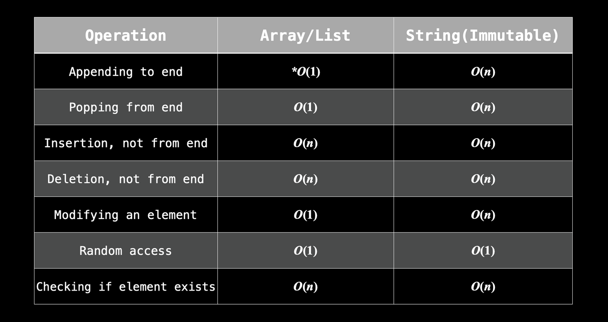

##   Arrays and strings

In terms of algorithm problems, arrays (1D) and strings are very  similar: they both represent an ordered group of elements.

"Array" can mean something different between languages. Javascript uses  dynamic arrays by default . Initialization is as easy as `arr = []`, and we don't  need to worry about the type of data you store in the array or the size  of the array. 

> Technically, an array can't be resized. A dynamic array, or list, can be.

Similarly, strings are implemented differently between languages. In  Javascript , they are immutable. In C++, they are mutable.

> Mutable: a type of data that can be changed. Immutable: A type of  data that cannot be changed. If you want to change something immutable,  you will need to recreate the entire thing.

Why should we care about something being mutable or immutable? If we have a mutable array `arr = ["a", "b", "c"]` and an immutable string `s = "abc"`, but we want to instead represent `"abd"`, we can easily do `arr[2] = "d"`, but we cannot do `s[2] = "d"`. As such, if we wanted the string `s = "abd"`, we would need to create it entirely from scratch. With such a small  string, it's not a big deal. But sometimes we are dealing with strings  with 100,000 characters, so creating new versions just to modify one  character is very expensive (O(n), where n is the size of the string).

> - Appending to the end of an array is [amortized O(1)](https://stackoverflow.com/questions/33044883/why-is-the-time-complexity-of-pythons-list-append-method-o1).