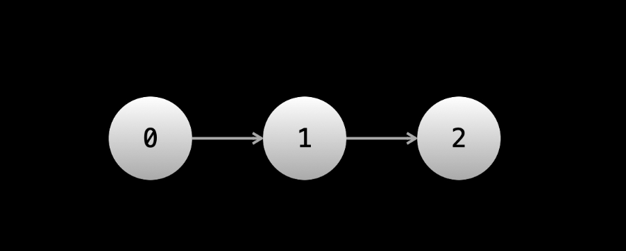

## Linked Lists

A Linked List is a data structure which store data in an ordered manner implemented using node objects (we will have a custom class that defined the Node object ) . Each Node will have a next pointer which points to the node representing the next element in the sequence 



#### Implementation of a Single Linked List ;- 

```js
class ListNode {
    constructor(val) {
        this.val = val;
        this.next = null;
    }
}

(function main() {
    let one = new ListNode(1);
    let two = new ListNode(2);
    let three = new ListNode(3);
    one.next = two;
    two.next = three;
    let head = one;
    

    console.log(head.val);
    console.log(head.next.val);
    console.log(head.next.next.val);

}());
```

Note -> We will want to keep a reference to the head because the head is the only node from where we can reach all elements in the Linked List

#### Advantages of Linked Lists compared to arrays :-

1. We can add and remove elements at any position in O(1).The caveat is that we need to have a reference to a node at the position in which we want to perform the addition/removal , otherwise the operation is O(n) , because we will need to iterate starting from the head until we get to the desired position .However this is still a better than a nomal dynamic array which requires O(n) for adding and removing from arbitrary position 
2. Linked Lists have the advantage of not having fixed sizes .While dynamic arrays can be resized , under the hood they still are allocated a fixed size when this size is exceeded the array is resized which is expensive 

#### Disadvantages Of Linked Lists compared to arrays :- 

1. There is no random access , if we have a large linked list and want to access the 150,000'th  element , then there usually isnt  a better way than to start at the head and iterate 150,000 times. So while an array has O(1) indexing m a linked list could require O(n) to access an element at a given position 
2. Linked Lists have more overhead than array - every element need to have extra storage for the pointers 

  